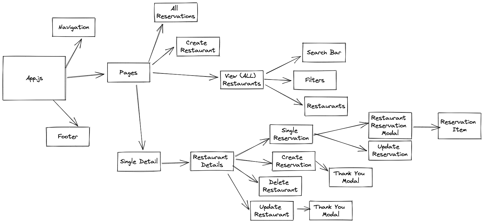

# Reservation-App-Coding-Challenge ~ Josh Marte

Hungry Humans is Reservation App client that interacts with a RESTful API using React (Web).

## Getting Started

### Routes

-   [Home](https://hungryhumans.netlify.app/)
-   [All Restaurants](https://hungryhumans.netlify.app/restaurants)
    -   Single Restaurant View
    -   Update / Delete Restaurant Modals
    -   Create Reservation Modal
    -   View All Reservations for a Restaurant
    -   Update Specific Reservation for a Restaurant
-   [Create a Restaurant](https://hungryhumans.netlify.app/newRestaurant)
-   [All Reservations](https://hungryhumans.netlify.app/reservations)

### Component Structure

